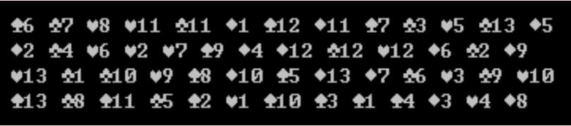

# 第12週

## 練習題1

[01.c](01.c)

- 宣告兩陣列，分別代表100位使用者帳號`User[100][16]`與使用者密碼`Password[100][16]`
    - 若要寫在一陣列裡亦可`UserPwd[100][2][16]`
    - 檢查時先宣告10即可
- 設計一程式，可讓使用者輸入帳號與密碼，然後檢查帳號與密碼是否與陣列中的任一資料符合
    - 均符合 → 顯示「帳號密碼正確」
    - 僅帳號正確 → 顯示「密碼錯誤」
    - 均不正確 → 顯示「無此帳號」
- 帳號不分大小寫，密碼分大小寫
- 可直接宣告兩陣列之內容，例如：
  ```
  char User[10][16] = {"User1", "User2", "User3", "User4", "User5", "User6", "User7", "User8", "User9", "User10"};
  ```
- 在判斷中會使用到迴圈，一旦使用者相同(無論密碼正不正確)，就不應再繼續判斷，此時，可使用`break;`跳出迴圈

```
請輸入帳號：User3
請輸入密碼：Correct
帳號密碼正確
```

```
請輸入帳號：User3
請輸入密碼：Incorrect
密碼錯誤
```

```
請輸入帳號：User300
請輸入密碼：Incorrect
無此帳號
```

## 練習題2

[02.c](02.c)

- 設計一程式，可輸入五長字串(`A[5][256]`)，完成後，再輸入一短字串(`B[64]`)，然後檢查此短字串是否在以上五長字串中出現過，若有，則秀出該長字串之內容
- 可不分大小寫

## 練習題3

[03.c](03.c)

- 設計一程式，可輸入五長字串(`A[5][256]`)，完成後，再輸入一短字串(`B[64]`)，然後檢查此短字串是否為以上五長字串的「句首」，若是，則秀出該長字串之內容
- 可不分大小寫

## 回家作業

[04.c](04.c)

- 設計一程式，內包含撲克牌中的52張牌，將其用亂數洗牌後分成四份，然後顯示出來
- 1代表A，2~10分別代表2~10，11代表J，12代表Q，13代表K
- 在ASCII表中，3代表♥ (Heart)、4代表♦ (Diamond)、5代表♣ (Clove)、6代表♠ (Spade)


